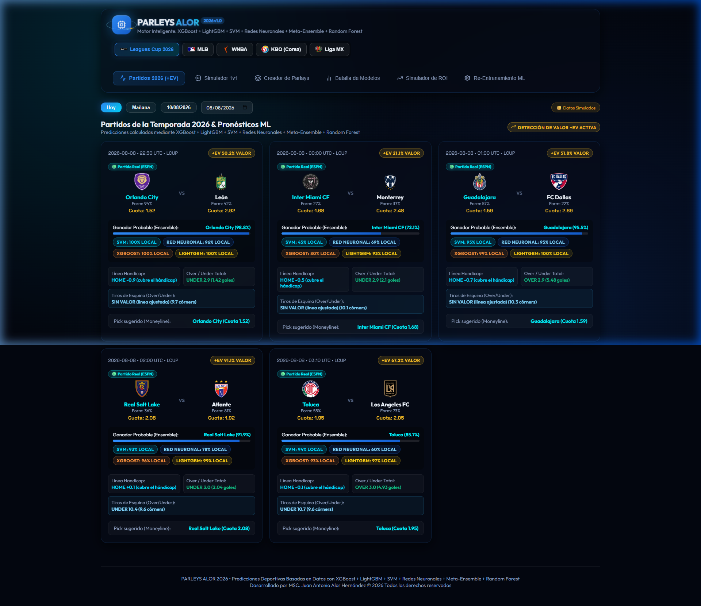
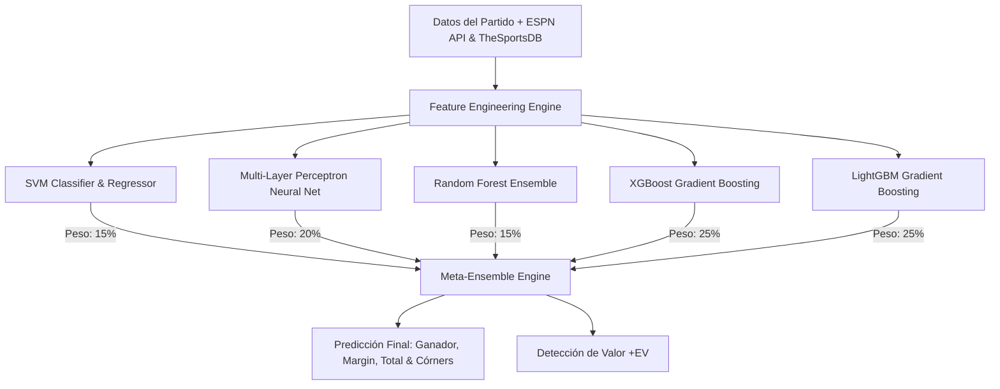

<div align="center">

# ⚡ PARLEYS AI & ALOR 2026 ⚡
### *Motor Inteligente de Pronósticos Deportivos y Análisis de Apuestas (+EV)*


[](https://pronosticos-ia.netlify.app/)

<p align="center">
  <b>Plataforma Full-Stack de Machine Learning Meta-Ensemble para la predicción de eventos deportivos (Liga MX, Leagues Cup 2026, NBA, MLB, WNBA, KBO, <strong>NFL Pretemporada</strong>) y optimización de apuestas combinadas (Parleys) con detección de valor +EV en tiempo real.</b>
  <br/><br/>
  🚀 <b>Demostración en vivo disponible en:</b> <a href="https://pronosticos-ia.netlify.app/"><b>https://pronosticos-ia.netlify.app/</b></a>
</p>

</div>

---

## 🖥️ Demostración en Vivo & Vista Previa

[](https://pronosticos-ia.netlify.app/)

> 🌐 **Accede a la aplicación en producción:** [https://pronosticos-ia.netlify.app/](https://pronosticos-ia.netlify.app/)

---

## 📋 Contenido

- [🌟 Aspectos Destacados](#-aspectos-destacados)
- [🤖 Arquitectura del Meta-Ensemble de IA](#-arquitectura-del-meta-ensemble-de-ia)
- [⚽ Ligas Soportadas y Datos en Vivo (ESPN API & TheSportsDB API)](#-ligas-soportadas-y-datos-en-vivo-espn-api--thesportsdb-api)
- [🛠️ Tecnologías Utilizadas](#️-tecnologías-utilizadas)
- [📂 Estructura del Proyecto](#-estructura-del-proyecto)
- [🚀 Instalación y Ejecución Local](#-instalación-y-ejecución-local)
- [🌐 Despliegue en la Nube (Vercel, Netlify, Railway)](#-despliegue-en-la-nube-vercel-netlify-railway)
- [📡 API Endpoints](#-api-endpoints)
- [👤 Autor](#-autor)

---

## 🌟 Aspectos Destacados

- 🧠 **Meta-Ensemble Ponderado:** Combina 5 modelos de IA avanzados para maximizar la precisión de predicción en probabilidad de victoria, hándicap, totales Over/Under y córners.
- 📈 **Detección de Apuestas con Valor (+EV):** Algoritmo automatizado que calcula el *Expected Value* comparando probabilidades de IA contra las cuotas implícitas de las casas de apuestas.
- 🌐 **Integración Dual (ESPN API + TheSportsDB API):** Descarga partidos en vivo, resultados históricos, horarios UTC y logotipos oficiales de los equipos para todas las ligas.
- 🇲🇽 **Soporte Especializado para Fútbol (Liga MX y Leagues Cup 2026):** Incluye modelo dedicado de regresión para predicción de **Córners Totales** en partidos de fútbol.
- 🏈 **NFL Pretemporada con Datos Históricos Reales:** Integración completa de la Pretemporada NFL descargando datos históricos de partidos jugados desde **ESPN API** (temporadas 2021-2025) y logos oficiales de equipos vía **TheSportsDB API**. El modelo se entrena con resultados reales de preseason, incluyendo ratings ofensivo/defensivo, ventaja de local y form de equipo ajustados a la volatilidad del preseason NFL.
- 🧮 **Calculadora e Creador de Parleys:** Genera apuestas combinadas personalizadas calculando cuotas compuestas, rendimiento estimado y evaluación de riesgo.
- 📊 **Backtester & Batalla de Modelos:** Módulo visual para comparar el rendimiento histórico de cada modelo individual (SVM vs Red Neuronal vs Random Forest vs XGBoost vs LightGBM).
- 🎨 **Diseño Moderno & Glassmorphism:** Interfaz futurista optimizada en modo oscuro con respuestas dinámicas de estado e iconos interactivos.

---

## 🤖 Arquitectura del Meta-Ensemble de IA

El motor predictivo no depende de una sola métrica, sino de una arquitectura de **Meta-Ensemble Ponderado**:



### Modelos Integrados y Pesos:
| Modelo | Algoritmo | Propósito Principal | Peso Ensemble |
| :--- | :--- | :--- | :---: |
| **XGBoost** | Extreme Gradient Boosting | Margen y Spread | `25%` |
| **LightGBM** | Light Gradient Boosting Machine | Totales Over/Under | `25%` |
| **Neural Network** | Multi-Layer Perceptron (MLP) | Probabilidad de victoria | `20%` |
| **SVM** | Support Vector Machines (Kernel RBF) | Clasificación de límites rígidos | `15%` |
| **Random Forest** | Bagging Ensemble Trees & Corners Regressor | Control de varianza y Córners | `15%` |

---

## ⚽🏈 Ligas Soportadas y Datos en Vivo (ESPN API & TheSportsDB API)

El sistema procesa información en tiempo real combinando las APIs de **ESPN** y **TheSportsDB**:

| Liga | Deporte | Cobertura / APIs | Targets Predichos |
| :--- | :--- | :--- | :--- |
| 🇲🇽 **Liga MX (`MX`)** | Fútbol | ESPN API + TheSportsDB | Ganador, Margen, Goles Totales, **Córners Totales** |
| 🏆 **Leagues Cup 2026 (`LCUP`)** | Fútbol | ESPN API + TheSportsDB | Ganador, Margen, Goles Totales |
| ⚾ **MLB (`MLB`)** | Béisbol | ESPN API + TheSportsDB (30 Equipos) | Ganador, Runline, Carreras Totales, ERA Pitcher |
| ⛹️‍♀️ **WNBA (`WNBA`)** | Baloncesto | ESPN API (Incluye expansión 2026) | Ganador, Hándicap/Spread, Puntos Totales |
| ⚾ **KBO (`KBO`)** | Béisbol | TheSportsDB + Fallback Simulado | Ganador, Runline, Carreras Totales |
| 🏈 **NFL Pretemporada (`NFL`)** | Fútbol Americano | ESPN API (histórico real 2021–2025) + TheSportsDB (logos) | Ganador, Spread/Hándicap, Puntos Totales |

### 🏈 NFL Pretemporada — Integración de Datos Históricos Reales

La liga NFL usa un pipeline de datos históricos real basado en ESPN API y TheSportsDB:

```
ESPN API (football/nfl/scoreboard)
  └── seasontype=1  → Pretemporada (agosto)
  └── seasontype=2  → Temporada Regular (sep-ene)
  └── seasontype=3  → Playoffs / Super Bowl
```

| Fuente | Uso |
| :--- | :--- |
| **ESPN Scoreboard API** | Partidos en vivo y próximos (pretemporada y regular). Consulta automática por `dates` sin parámetro extra de `seasontype` — ESPN resuelve la temporada activa. |
| **ESPN Historical API** | Resultados terminados de temporadas 2021–2025 (preseason + regular) para entrenar el Meta-Ensemble con datos reales de puntos y márgenes NFL. |
| **TheSportsDB API** | Logos oficiales de los 32 equipos NFL (badge transparent PNG), badge de la liga y mapeo de nombres de equipos entre fuentes. |

**Equipos cubiertos (32 franquicias):** Arizona Cardinals, Atlanta Falcons, Baltimore Ravens, Buffalo Bills, Carolina Panthers, Chicago Bears, Cincinnati Bengals, Cleveland Browns, Dallas Cowboys, Denver Broncos, Detroit Lions, Green Bay Packers, Houston Texans, Indianapolis Colts, Jacksonville Jaguars, Kansas City Chiefs, Las Vegas Raiders, Los Angeles Chargers, Los Angeles Rams, Miami Dolphins, Minnesota Vikings, New England Patriots, New Orleans Saints, New York Giants, New York Jets, Philadelphia Eagles, Pittsburgh Steelers, San Francisco 49ers, Seattle Seahawks, Tampa Bay Buccaneers, Tennessee Titans, Washington Commanders.

---

## 🛠️ Tecnologías Utilizadas

### Backend (Python / FastAPI)
- **FastAPI 0.111** — Framework web asíncrono de alto rendimiento.
- **Scikit-Learn 1.5** — Preprocesamiento, escalado y modelos SVM / Random Forest / MLP.
- **Pandas & NumPy** — Manipulación matricial y feature engineering de vectores deportivos.
- **HTTPX** — Cliente HTTP asíncrono para consumo de **ESPN API** y **TheSportsDB API**.
- **Mangum** — Adaptador ASGI a AWS Lambda / Netlify Serverless Functions.
- **Uvicorn** — Servidor ASGI ultrarrápido para entorno local.

### Frontend (React / Vite)
- **React 19** — Interfaz declarativa basada en componentes funcionales y Hooks.
- **Vite 6** — Empaquetador y entorno de desarrollo ultra veloz.
- **Lucide React** — Colección de iconos vectoriales modernos.
- **Vanilla CSS3** — Sistema de diseño personalizado con Glassmorphism y temas Neón.

---

## 📂 Estructura del Proyecto

```text
parleys/
├── 📄 README.md                    # Documentación principal del proyecto
├── 📄 netlify.toml                # Configuración de despliegue Frontend en Netlify
├── 📄 deploy.bat                  # Script automatizado de despliegue local/cloud
├── 📄 run_app.bat                 # Lanzador rápido de servidores local (Backend + Frontend)
│
├── 📂 backend/                    # Core del Servidor API y Motor ML
│   ├── 📄 requirements.txt        # Dependencias de Python para Serverless/Cloud
│   ├── 📄 vercel.json             # Configuración Serverless para Vercel (@vercel/python)
│   ├── 📄 netlify.toml            # Configuración Serverless para Netlify Functions
│   ├── 📂 api/
│   │   └── 📄 index.py            # Punto de entrada Vercel Serverless Function
│   ├── 📂 netlify/
│   │   └── 📂 functions/
│   │       └── 📄 api.py          # Handler Mangum para Netlify Functions
│   └── 📂 app/
│       ├── 📄 main.py             # Aplicación principal FastAPI & Endpoints
│       └── 📂 ml/
│           ├── 📄 sports_api.py   # Conector ESPN API + TheSportsDB API + mapeo de logos
│           ├── 📄 kbo_thesportsdb.py # Módulo especializado para datos TheSportsDB
│           ├── 📄 ensemble_model.py # Meta-Ensemble ML (XGB, LGBM, SVM, NN, RF)
│           ├── 📄 feature_engineering.py # Extracción de vectores de características
│           ├── 📄 data_generator.py # Perfiles de equipos y fallback simulado
│           ├── 📄 backtester.py   # Motor de simulación histórica
│           └── 📄 svm_model.py    # Sub-modelo SVM
│
└── 📂 frontend/                   # Interfaz de Usuario React + Vite
    ├── 📄 package.json            # Dependencias del Frontend
    ├── 📄 vite.config.js          # Configuración del empaquetador Vite
    ├── 📄 vercel.json             # Configuración SPA Routing para Vercel
    ├── 📄 .env.production         # URL base para conectar con el backend en la nube
    └── 📂 src/
        ├── 📄 App.jsx             # Contenedor principal y enrutado de pestañas
        ├── 📄 index.css           # Tokens de diseño, gradientes y animaciones
        ├── 📂 components/
        │   ├── 📄 Header.jsx      # Selector de liga (MX, LCUP, NBA, MLB, WNBA, KBO)
        │   ├── 📄 DailyFixtures.jsx # Tarjetas de partidos en vivo y cuotas +EV
        │   ├── 📄 TeamIcon.jsx    # Renderizador inteligente de logos ESPN / TheSportsDB
        │   ├── 📄 MatchPredictor.jsx # Simulador de partidos 1v1 personalizado
        │   ├── 📄 ParlayBuilder.jsx # Creador y calculadora de apuestas combinadas
        │   ├── 📄 ModelComparison.jsx # Comparador de precisión entre modelos
        │   ├── 📄 BacktestSimulator.jsx # Rendimiento histórico y simulación ROI
        │   └── 📄 ModelTrainerUI.jsx # Interfaz para re-entrenar modelos
        └── 📂 services/
            └── 📄 api.js          # Cliente HTTP para comunicación con FastAPI
```

---

## 🚀 Instalación y Ejecución Local

### 1. Clonar el repositorio
```bash
git clone https://github.com/Jalorh85/Parleys.git
cd Parleys
```

### 2. Iniciar Backend y Frontend automáticamente (Windows)
Ejecuta el script incluido en la raíz:
```cmd
run_app.bat
```

### 3. Iniciar manualmente (Opción Alternativa)

#### Backend:
```bash
cd backend
py -3 -m venv .venv
# En Windows activar: .venv\Scripts\activate
pip install -r requirements.txt
uvicorn app.main:app --port 8000 --reload
```

#### Frontend:
```bash
cd frontend
npm install
npm run dev
```

> 🌐 Abrir en el navegador: `http://localhost:5173`

---

## 🌐 Despliegue en la Nube (Vercel, Netlify, Railway)

El proyecto está 100% preparado con archivos de configuración serverless independientes:

### 🔺 Despliegue en Vercel
- **Backend:** Conecta tu repo en Vercel y establece el *Root Directory* en `backend`. Utilizará [`backend/vercel.json`](file:///C:/Users/JuaN/Desktop/parleys/backend/vercel.json) automáticamente.
- **Frontend:** Crea un proyecto en Vercel estableciendo el *Root Directory* en `frontend`.

### 🌐 Despliegue en Netlify
- **Backend:** Importa el proyecto en Netlify configurando el *Base Directory* en `backend`. Procesará [`backend/netlify.toml`](file:///C:/Users/JuaN/Desktop/parleys/backend/netlify.toml) y [`backend/netlify/functions/api.py`](file:///C:/Users/JuaN/Desktop/parleys/backend/netlify/functions/api.py).
- **Frontend:** El archivo raíz [`netlify.toml`](file:///C:/Users/JuaN/Desktop/parleys/netlify.toml) compilará automáticamente la app desde la carpeta `frontend`.

### 🚂 Despliegue en Railway
- El directorio `backend` incluye `Procfile` y `railway.toml` para despliegue en contenedor Docker continuo.

---

## 📡 API Endpoints

| Método | Endpoint | Descripción |
| :---: | :--- | :--- |
| `GET` | `/api/leagues` | Obtiene la lista de ligas soportadas (`MX`, `LCUP`, `MLB`, `WNBA`, `KBO`, `NFL`) |
| `GET` | `/api/fixtures?league=MX&date=YYYY-MM-DD` | Devuelve los partidos del día con predicciones del Meta-Ensemble (incluye córners para Liga MX) |
| `GET` | `/api/fixtures?league=NFL&date=YYYY-MM-DD` | Partidos de Pretemporada NFL con predicciones de spread y total (datos reales ESPN) |
| `POST` | `/api/predict` | Realiza una predicción personalizada 1v1 entre dos equipos (soporta `NFL`) |
| `GET` | `/api/backtest?league=NFL` | Simulación histórica de rendimiento NFL con datos reales de pretemporada (ESPN 2021-2025) |
| `POST` | `/api/train?league=NFL` | Re-entrena el Meta-Ensemble NFL con datos históricos reales de ESPN + TheSportsDB |

---

## 👤 Autor

Desarrollado con pasión por los datos y el deporte:

**MSC. Juan Antonio Alor Hernández**  
*Especialista en IA & Arquitectura de Software*  
© 2026 Todos los derechos reservados.

---
<div align="center">
  <sub>Construido con ❤️ usando FastAPI, React 19, ESPN API, TheSportsDB API y Machine Learning.</sub>
</div>
